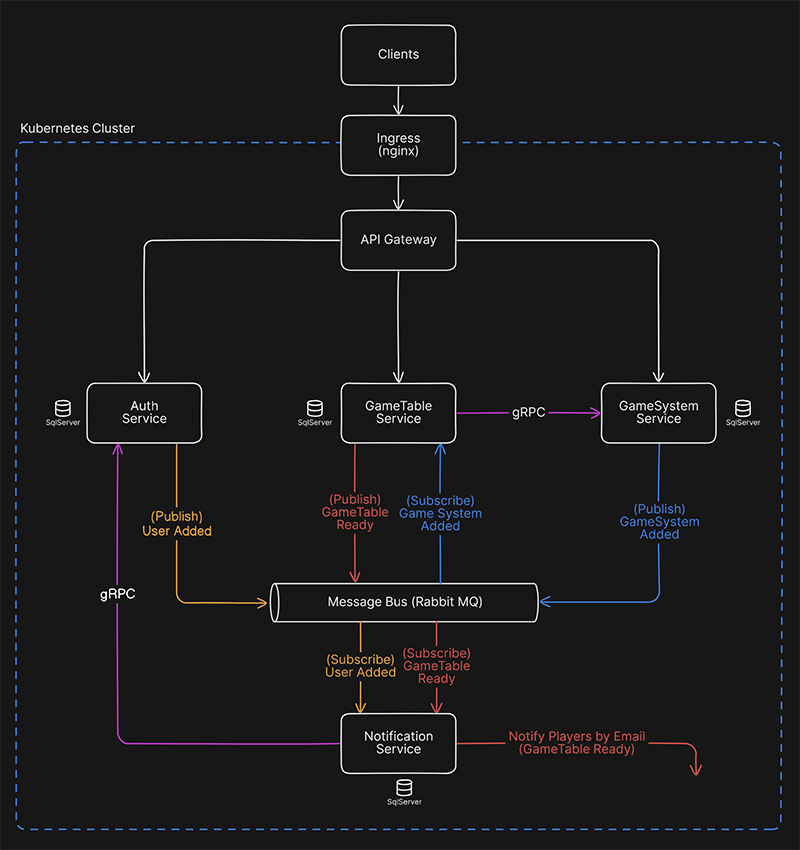
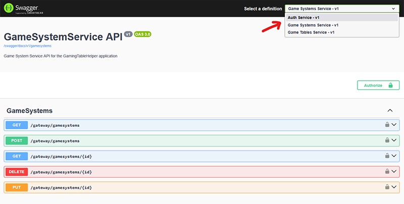

# GamingTableHelper

       

**GamingTableHelper** is a microservices-based backend application built with .NET and Kubernetes to streamline tabletop gaming tables at conventions. Attendees can easily create, find, and join game tables to play together during the event.

Developed by **Sílvio Medeiros** and **Paulo Medeiros** as a portfolio project.

# Table of Contents

- [Core Features](#core-features)
- [Technologies Used](#technologies-used)
- [Architecture Overview](#architecture-overview)
	- [Microservices](#microservices)
- [Running the Application](#running-the-application)
	- [Running with Skaffold](#running-with-skaffold-easy-setup)
	- [Clean-up](#clean-up)
	- [Testing the Endpoints](#testing-the-endpoints)
- [Potential Extensions](#potential-extensions)
- [Disclaimers](#disclaimers)

# Core Features

- User registration and authentication
- Create and manage Tabletop Game systems (Arkham Horror, D&D 5e etc.)
- Create, search and join game tables created by other users
- Player notifications when a game table is full and ready to go

# Technologies Used

| Category           | Tech Stack            |
| ------------------ | --------------------- |
| Language           | C# .NET 9             |
| Async Messaging    | RabbitMQ              |
| Sync Communication | gRPC                  |
| Authentication     | JWT bearer tokens     |
| Containerization   | Docker                |
| Orchestration      | Kubernetes + Skaffold |
| API Gateway        | Ocelot                |
| Database           | EF Core + SQL Server  |

# Architecture Overview

The application follows a microservices architecture. Each service is deployed independently and communicates through RabbitMQ and gRPC (on service startup) to ensure database consistency. An API Gateway handles incoming requests and routes them to the correct service. Notification Service listens for events (like a game table reaching capacity) and sends a notification to users.

### **Microservices**:

- **Auth Service**: Handles user authentication and issues JWTs. Sends messages when new users are created.
- **GameSystem Service**: CRUD operations for game systems. Sends messages to notify other services of resource creation/changes.
- **GameTable Service**: Manages game tables and player participation. Sends messages to notify other services when a game table is ready. Consumes messages to update the Game Systems available.
- **Notification Service**: Handles notification to players. Consumes messages to notify players when a game table is ready. Also consumes messages to update the Emails from Users.
- **Ingress and Api Gateway**: Acts as a single entry point for external requests, routing them to the appropriate services.

# Running the application

This project is designed to run on a local Kubernetes cluster using **Skaffold** to automate build and deployment.

### Running with Skaffold:
- Install [Docker Desktop](https://www.docker.com/products/docker-desktop/)
- Open Docker Desktop and enable Kubernetes in Options
- Download [Skaffold](https://skaffold.dev/docs/install/#standalone-binary), rename it to skaffold.exe and put it in the project root folder
- Open a terminal in the root folder of the project and run this command:

	`.\skaffold.exe run`

- This will:
	- Build Docker images for each microservice
	- Deploy all services to your Kubernetes cluster
	- Apply Kubernetes configurations (Ingress, etc.)

### Clean-up:
- Once you're done using the application you may want to clean up the deployments, services etc. from your kubernetes cluster. To do so, run this command from the project root folder:

	`.\skaffold.exe delete`

- Finally, if you also want to delete the local docker images related solely to this application, wait for all the kubernetes pods to be down and run this command:

	`docker images --filter "label=project=gamingtablehelper" --quiet | ForEach-Object { docker rmi -f $_ }`

- Additionally, if you want to remove all unused docker images in your system, run:

	`docker system prune`

# Testing the Endpoints

You can interact with the API endpoints through Swagger UI, which is available once the application is running. There are two ways to access the Swagger UI:

### Using Ingress (Requires editing hosts file)

When using the Ingress controller, you can access the API Gateway and Swagger UI through a friendly local domain. To enable this:
1. Edit your system's `hosts` file to map the domain `gamingtablehelper.local` to that IP:
	- On **Windows**, open Notepad as Administrator and edit:
		`C:\Windows\System32\drivers\etc\hosts`
	- On **Linux/macOS**, edit `/etc/hosts` with sudo:
		`sudo nano /etc/hosts`
2. Then add the following line to the end of the file:
	`127.0.0.1 gamingtablehelper.local`
3. Finally, save the file, open your browser and access the Swagger UI on the following address:
	`http://gamingtablehelper.local/swagger/index.html`

### Using the API Gateway Load Balancer

To make it simpler to test the application we added a load balancer directly to the API Gateway. You can access it without editing any files on your computer. You can find the Swagger UI in the following address:
	`http://localhost:10555/swagger/index.html`

Once you access the Swagger UI, you can navigate between the Endpoints for each microservice by using the dropdown menu in the upper-right corner.

# Next Steps

This project is built to be extendable. Possible next steps include:

- Unit and Integration tests
- Building a frontend
- User profiles and game history
- Matchmaking based on preferences

# Disclaimers

This is primarily a portfolio project, but in a real-world application there are several strings that should be kept safe, like passwords for databases, encryption keys etc. We purposefully left these strings unprotected to avoid bloating the code with secret-keeping features that would only have a purpose in a real-world applications.
